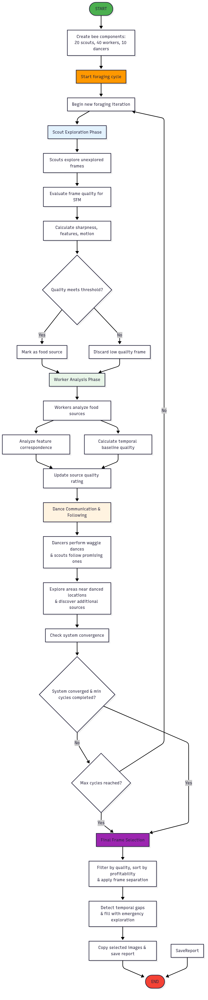

# Bio-SFM Optimization

## Overview

This project implements a bio-inspired frame selection system for Structure from Motion (SFM), simulating the collective intelligence of a bee swarm. The system is composed of several modules that work together to explore, analyze, and select the best frames from an image sequence, using models inspired by insect biology and computer vision techniques. Each file in the project represents a key component of the process, from the simulation of the compound eye to the coordination of the swarm and the evaluation of frame quality.


The main goal is to automate the selection of relevant images for 3D reconstruction, mimicking how bees explore their environment, communicate discoveries, and make collective decisions to maximize efficiency and result quality.

---

## Block Diagram

Below is a block diagram illustrating the behavior of the program:



---

## What does it do?

The script receives a set of image frames (e.g., from a video or image sequence) intended for SFM. Instead of using all frames, which can be computationally expensive and redundant, it selects a subset of frames that maximize reconstruction quality while minimizing processing time.

## How does it work?

The algorithm models a swarm of artificial bees, each with a simulated compound eye. Bees explore the frame set, evaluate frame quality (sharpness, feature density, motion, spatial distribution), and communicate promising locations using a waggle dance mechanism. The collective decision process ensures that selected frames are both diverse and optimal for SFM.

---

## Detailed analysis of the programs

### `main.py`
The entry point and orchestrator of the entire frame selection process. Loads images, initializes the swarm (`HiveMind`), runs the foraging cycle, and manages output results, including copying selected images and generating a summary JSON. Allows parameterization of the number of scout and worker bees, and provides a command-line interface.

### `hivemind.py`
Implements the `HiveMind` class, representing the collective mind of the swarm. Coordinates exploration, evaluation, and communication among bees (scouts, workers, and dancers). Manages the foraging cycle, global memory of food sources (high-quality frames), detection of large gaps between selected frames, and convergence of the process. Uses concurrency to simulate distributed bee activity.

### `bees.py`
Defines the agent classes: `ScoutBee` (explorer), `WorkerBee` (worker), and `WaggleDancer` (dancer). Each bee type has specific responsibilities:
- `ScoutBee`: explores the frame space, evaluates quality and spatial memory, and proposes new sources.
- `WorkerBee`: performs detailed evaluations of proposed frames, analyzing correspondences and SFM potential.
- `WaggleDancer`: communicates the locations of the best frames to other bees via a simulated waggle dance.

### `eye.py`
Simulates the insect compound eye through the `CompoundEye` class, composed of multiple ommatidia and motion receptors. Processes visual information from frames, detecting motion and local variations, and computes bio-inspired metrics such as motion saliency and directional bias. This module is essential for visual quality assessment of frames.

### `bee_types.py`
Defines the fundamental types and data structures for the system, such as bee behavior states (`BeeBehaviorState`), spatial location representation (`SpatialLocation`), and the abstraction of food sources (`FoodSource`). Includes methods to calculate the profitability of each source in terms of quality and computational cost.

### `logconfig.py`
Configures logging for the entire project, enabling the recording of relevant process information, warnings, and errors, which facilitates monitoring and debugging.

### `explicacion.txt`
An explanatory document detailing the biological inspiration behind each system component, the analogy with real insect behavior, and the swarm intelligence approach applied to frame selection.

---

### Input
- The images must be located in a folder structure as follows:
	- `(some number, e.g., 001)/images/data/` (e.g., `001/images/data/`)
- The folder should contain the image frames (JPG, PNG, BMP, etc.) to be used for SFM.


### Output
- The output will be generated in: `(same number as input)/output/` (e.g., `001/output/`)
- Inside the output folder:
	- `data/` will contain the result information (summary JSON, etc.)
	- `images/` will contain the selected images.
## Usage

Run the main program indicating the base folder identifier and optional parameters:

```bash
python main.py 001 --n_scouts 20 --n_workers 40
```


## Note on COLMAP Usage

To evaluate processing times and reconstruction quality, COLMAP was used as the SFM pipeline. However, direct integration with COLMAP (via code or command-line) is not present in this repository. Instead, the COLMAP GUI was used manually to run experiments after frame selection. This approach was chosen for modularity and testing purposes.

---

## Authors

- **Dylan Gerardo Garbanzo Fallas** (Principal Author)
- **Luis Alberto Chavarría Zamora** (Co-author)
- **Pablo Soto-Quiros** (Co-author)

## Research Project

This work is part of a research project at Instituto Tecnológico de Costa Rica (Project No. 1440054).
